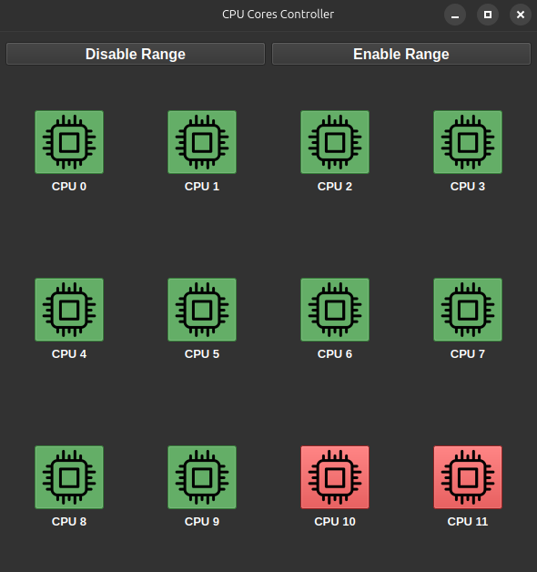

# CPU Controller for Linux

**Description:** CPU Controller for Linux is a straightforward GUI application based on PyQt6, enabling users to toggle individual CPU cores on or off in a Linux system to save battery life. This functionality serves purposes such as power management and troubleshooting.



## Installation

To install the CPU Controller for Linux, use the following pip command:

```bash
pip install cpu-controller-linux
```

After installation, run the application in the terminal with:

```bash
cpu-controller
```

## Application Interface

The application interface consists of buttons representing each CPU core, along with a labeled core number. Clicking the respective buttons toggles the cores on or off.

## Enabling All Cores

Upon closing the application, a prompt will confirm whether to enable all CPU cores. Clicking "Yes" in the prompt activates all CPU cores.


### Feel free to contribute and report issues